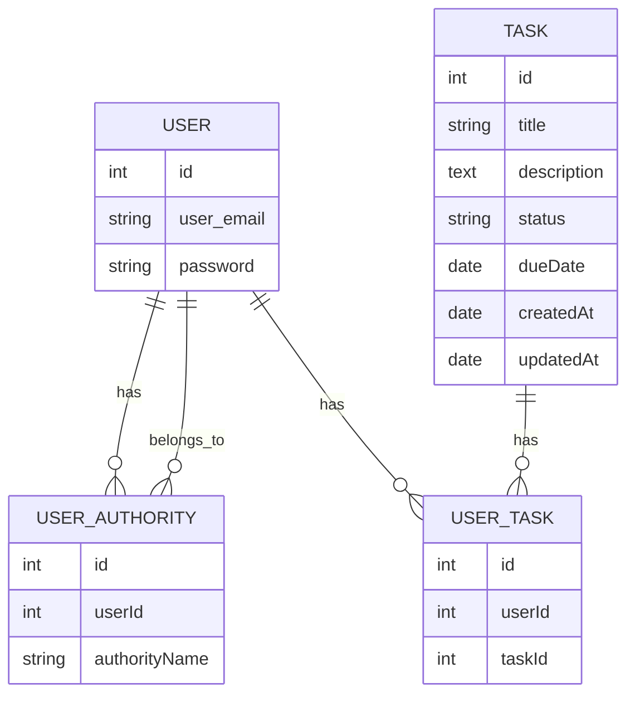

## Goal

https://github.com/Hansanghyeon/fullstack-challenge/discussions/1

## ERD

```mermaid
erDiagram
    USER {
        int id
        string user_email
        string password
    }
    
    TASK {
        int id
        string title
        text description
        string status
        date dueDate
        date createdAt
        date updatedAt
    }

    USER_AUTHORITY {
        int id
        int userId
        string authorityName
    }

    USER_TASK {
        int id
        int userId
        int taskId
    }

    USER ||--o{ USER_AUTHORITY : has
    USER_AUTHORITY }o--|| USER : belongs_to
    
    USER ||--o{ USER_TASK : has
    TASK ||--o{ USER_TASK : has
```